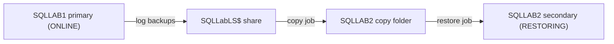

# SQL Server DBA Operations Lab

This repository documents a hands-on SQL Server administration lab built on one Windows host with two isolated SQL Server 2025 Developer Edition named instances. The project demonstrates database deployment, backup and recovery, SQL Server Agent automation, Query Store analysis, Extended Events troubleshooting, health monitoring, security administration, and bidirectional log-shipping exercises.

All workload data is synthetic. Public documentation uses anonymized host and account names.

## Lab outcomes

- Installed and configured two named Database Engine instances.
- Built an `OperationsLab` database with application and audit schemas.
- Generated a repeatable synthetic workload and validated relational integrity.
- Automated full, differential, and transaction-log backups with retention cleanup.
- Restored and validated backups on the second instance.
- Used Query Store to identify regressions and practice plan forcing and unforcing.
- Captured and analyzed a reproducible deadlock with Extended Events.
- Collected wait, file-latency, session, and host-health snapshots.
- Created a Windows Performance Monitor baseline.
- Configured service-account permissions, database roles, and auditing controls.
- Configured log shipping, performed controlled role reversals, and returned to the original topology.
- Verified zero data loss in the controlled failback test and completed `DBCC CHECKDB` without errors.

## Environment

| Component | Configuration |
|---|---|
| Host | One Windows lab workstation, published as `LABHOST` |
| Primary instance | `LABHOST\SQLLAB1` / `localhost,14331` |
| Secondary instance | `LABHOST\SQLLAB2` / `localhost,14332` |
| SQL Server | SQL Server 2025 Developer Edition, 64-bit |
| Management client | SQL Server Management Studio 22.10.1 |
| Database | `OperationsLab` |
| Database compatibility | 170 |
| Recovery model | `FULL` |
| Instance memory | Minimum 0 MB; maximum 16,384 MB per instance |
| MAXDOP | 8 per instance |
| Log-shipping share | `\\LABHOST\SQLLabLS$` |

## Final topology

At project closeout, `SQLLAB1` was the writable primary and `SQLLAB2` was the restoring secondary. The backup, copy, and restore jobs were enabled, and both Transaction Log Shipping Status reports showed `Good` for the active direction.

## Database design

The `OperationsLab` database contains five workload tables and one audit table:

| Schema | Table | Purpose |
|---|---|---|
| `app` | `Customers` | Synthetic customer master data |
| `app` | `Products` | Product, price, and inventory data |
| `app` | `Orders` | Order headers and status information |
| `app` | `OrderItems` | Order line details and computed totals |
| `app` | `Payments` | Payment events associated with orders |
| `audit` | `ChangeLog` | Workload, backup, and role-transition markers |

The database also includes these workload procedures:

- `app.usp_GetCustomerOrders`
- `app.usp_GetOrdersByStatusSource`
- `app.usp_GetProductSales`

## Repository contents

- `docs/architecture.md` — topology, components, configuration, and design decisions.
- `docs/log-shipping-runbook.md` — operating, failover, failback, and validation procedures.
- `docs/test-results.md` — verified outcomes and final recovery evidence.
- `docs/troubleshooting.md` — problems encountered, causes, corrections, and preventive checks.
- `scripts/` — ordered T-SQL and PowerShell source files added as the lab is packaged.
- `evidence/` — sanitized screenshots referenced by the documentation.

Recommended script grouping:

1. `scripts/01-instance-configuration/`
2. `scripts/02-database-build/`
3. `scripts/03-backup-recovery/`
4. `scripts/04-agent-automation/`
5. `scripts/05-query-store/`
6. `scripts/06-extended-events/`
7. `scripts/07-health-monitoring/`
8. `scripts/08-security/`
9. `scripts/09-log-shipping/`
10. `scripts/powershell/`

## Suggested execution order

The scripts should be run in numbered folder order. Within each folder, use two-digit filename prefixes such as `01_`, `02_`, and `03_` to make dependencies explicit.

Before running any recovery or role-transition script:

1. Replace the sample host, instance, folder, share, and service-account values.
2. Confirm the active primary and current database states.
3. Confirm the SQL Server Agent service is running on both instances.
4. Verify share and NTFS access by the SQL Server Database Engine and Agent service accounts.
5. Test in a disposable environment before using any command against another system.

## Verified final results

| Check | Verified result |
|---|---|
| Final primary | `LABHOST\SQLLAB1`; `OperationsLab` `ONLINE` and `MULTI_USER` |
| Final secondary | `LABHOST\SQLLAB2`; `OperationsLab` `RESTORING` and `MULTI_USER` |
| Active log-shipping direction | `SQLLAB1` to `SQLLAB2` |
| Log-shipping status | `Good` on both instances |
| Controlled failback marker | `FA02E255-515B-4BE2-990C-991C81748635` |
| Marker audit ID | `20005` |
| Marker timestamp | `2026-09-28 05:53:19.718` UTC |
| Tail-log backup | `OperationsLab_20260928060131.trn` |
| First unattended post-failback log | `OperationsLab_20260928063200.trn` |
| Controlled-test RPO | 0 transactions lost |
| RTO | Not precisely instrumented; therefore not claimed |
| Integrity check | 0 allocation errors and 0 consistency errors |

## Evidence index

Place the final sanitized screenshots at these paths:

| Evidence | File |
|---|---|
| SQLLAB1 log-shipping status | `evidence/01_SQLLAB1_LogShipping_Good.png` |
| SQLLAB2 log-shipping status | `evidence/02_SQLLAB2_LogShipping_Good.png` |
| SQLLAB1 final database state | `evidence/03_SQLLAB1_Final_Database_State.png` |
| SQLLAB2 final database state | `evidence/04_SQLLAB2_Final_Database_State.png` |
| SQLLAB1 backup-job history | `evidence/05a_SQLLAB1_Backup_Job_History.png` |
| SQLLAB2 copy/restore-job history | `evidence/05b_SQLLAB2_Copy_Restore_Job_History.png` |
| Final integrity-check result | `evidence/06_DBCC_CHECKDB_Result.png` |

Detailed verification is recorded in [docs/test-results.md](docs/test-results.md).

## Important limitations

- Both SQL Server instances run on one physical Windows host. This is useful for learning but does not provide host-level high availability or disaster recovery.
- SQL Server Developer Edition is licensed for non-production development and testing only.
- Log shipping requires a manual role transition; it is not automatic failover.
- The zero-data-loss result applies only to the controlled test documented here. Actual RPO depends on backup frequency, copy/restore latency, and whether a tail-log backup remains possible.
- The exercise did not capture a defensible end-to-end RTO measurement.

## Safety and publication notes

Do not commit database backups, transaction-log backups, Extended Events data files, Performance Monitor logs, credentials, private keys, connection strings with secrets, or screenshots containing personal information. Review every script for machine-specific paths and identities before publishing.

## Documentation

- [Architecture](docs/architecture.md)
- [Log-shipping runbook](docs/log-shipping-runbook.md)
- [Test results](docs/test-results.md)
- [Troubleshooting notes](docs/troubleshooting.md)
